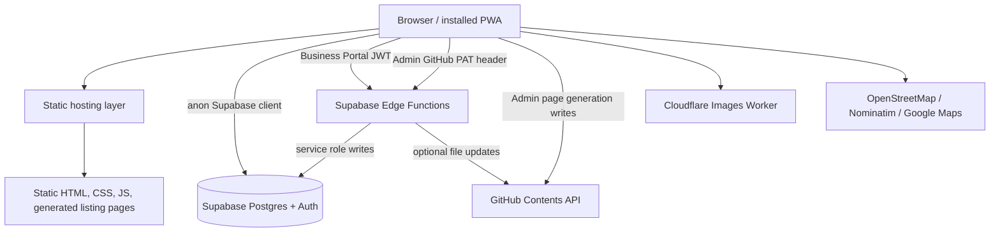
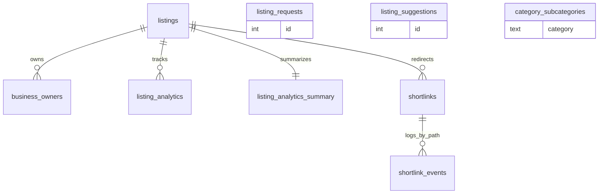

# The Greek Directory

The Greek Directory is a static-first directory application for Greek-owned and Greek-themed businesses. It serves public discovery pages, generated SEO-friendly listing pages, a business owner portal, an admin portal, PWA/offline utilities, listing submission and edit-suggestion flows, and Supabase-backed analytics.

The repository is intentionally frontend-heavy: most pages are static HTML, CSS, and vanilla JavaScript served directly by the hosting layer. Runtime data comes from Supabase, while individual listing pages are generated as committed HTML files for fast page loads and search indexing.

> **Supabase source of truth:** `SUPABASE.md` is the authoritative documentation for the Supabase project, schema, functions, RLS policies, storage state, auth configuration, analytics architecture, and Edge Functions. This README summarizes the integration and points contributors to `SUPABASE.md` for implementation-level details.

## What the application includes

- Public homepage with featured and recent listings loaded from Supabase.
- Searchable listing directory with category, subcategory, location, radius, hours, pricing, online, coming-soon, and starred-listing filters.
- Map and split-map experiences powered by Leaflet, Leaflet MarkerCluster, OpenStreetMap tiles, and browser geolocation/IP-based location hints.
- Generated listing detail pages under `listing/` with structured data, photos, hours, map, directions, share links, analytics tracking, and related chain locations.
- Public listing submission flow that inserts into the Supabase `listing_requests` intake table.
- Public suggestion flow that preloads an existing listing and inserts proposed edits into `listing_suggestions`.
- Business Portal for owners to claim/sign in, edit allowed listing fields, upload media, manage contact visibility, change passwords, and view analytics.
- Admin Portal for listing CRUD, owner records, request/suggestion review, category/subcategory management, shortlink management, analytics review, listing-page generation, sitemap updates, and CSV import.
- PWA features including manifests, service workers, offline fallback, starred listing persistence, app settings, and translation helpers.
- Cloudflare Images upload proxy for listing logos, photos, and videos.
- Supabase Edge Functions for server time, owner-scoped listing updates, admin proxying, and GitHub file updates.

## Technology stack

| Area | Implementation |
| --- | --- |
| Frontend | Static HTML, vanilla JavaScript, CSS |
| Styling | Page-specific CSS plus committed Tailwind-style output in `src/output.css`; `admin.html` still uses Tailwind CDN by explicit file-level instruction |
| Data/API | Supabase Postgres and Supabase JS v2 |
| Auth | Supabase Auth for Business Portal users; GitHub PAT-based custom auth for Admin Portal operations |
| Admin writes | Supabase `admin-proxy` Edge Function and GitHub Contents API writes from the browser/admin tooling |
| Business owner writes | Supabase `update-listing-bp` Edge Function with JWT validation, owner verification, and field allowlists |
| Media | Cloudflare Images via `cloudflare/tgd-images-upload.js` Worker |
| Maps/geocoding | Leaflet, Leaflet MarkerCluster, OpenStreetMap tiles, Nominatim, Google Maps directions URLs |
| PWA | `manifest.json`, `business-manifest.json`, `service-worker.js`, `business-sw.js`, IndexedDB, localStorage/cookies |
| Translation | GTranslate widget plus local offline translation helpers |
| Analytics | Supabase `listing_analytics`, trigger-maintained `listing_analytics_summary`, scheduled GitHub Actions refresh |
| Deployment files | Static root assets, Cloudflare Pages-style `_redirects`/`_headers`, GitHub Pages workflow, `CNAME` |

## Architecture



### Runtime data flow

1. Public pages are delivered as static files.
2. Directory, homepage, map, starred, submit, and suggest-edit scripts instantiate the Supabase JS client with the public anon key.
3. Public browsing reads visible rows from `listings` and related lookup data from `category_subcategories`.
4. Listing pages insert interaction events into `listing_analytics`; database triggers update `listing_analytics_summary`.
5. Business Portal users authenticate with Supabase Auth, then owner updates are sent to `update-listing-bp` so the server can verify ownership and restrict editable fields.
6. Admin Portal users provide a GitHub PAT. The admin UI sends service-level database actions through `admin-proxy` and writes generated listing pages/sitemaps through the GitHub Contents API.
7. Generated listing pages are committed into `listing/` and served as static HTML.

## Repository structure

```text
.
├── index.html                 # Homepage
├── listings.html              # Main searchable directory
├── listing-template.html      # Template used by admin tooling to generate listing pages
├── listing/                   # Generated listing detail pages
├── map.html                   # Standalone map view
├── categories.html            # Category browser
├── starred.html               # Saved/starred listings page
├── submit-listing.html        # Public listing request form
├── suggest-edit.html          # Public edit suggestion form
├── business.html              # Business Portal shell
├── admin.html                 # Admin Portal shell
├── app.html                   # App/PWA install page
├── settings.html              # PWA settings page
├── offline.html               # Service-worker fallback page
├── reserved.html              # Placeholder for reserved future route families
├── css/                       # Page and feature styles
├── js/                        # Frontend modules for public, admin, business, forms, and shared behavior
│   └── pwa/                   # PWA storage, dock, starred, directions, settings, and offline helpers
├── partials/                  # Header and footer fragments loaded client-side
├── assets/ and images/        # Logos and listing media committed in the repo
├── widgets/                   # Embeddable widgets
├── cloudflare/                # Cloudflare Worker source for image uploads
├── functions/                 # Pages/Workers middleware source
├── supabase/edge-functions/   # Reference copies of Supabase Edge Functions
├── supabase/sql/              # SQL export/reference artifacts
├── scripts/                   # Utility scripts, including Tailwind output generation
├── src/input.css              # Tailwind input
├── src/output.css             # Committed generated stylesheet used by most pages
├── .github/workflows/         # GitHub Actions workflows
├── sitemap*.xml               # Sitemap files
├── _redirects, _headers       # Static-hosting routing/header configuration
├── SUPABASE.md                # Authoritative Supabase audit and implementation reference
└── package.json               # Node scripts for stylesheet generation
```

## Supabase integration overview

The active Supabase project is documented in `SUPABASE.md` as project `luetekzqrrgdxtopzvqw`, with API URL `https://luetekzqrrgdxtopzvqw.supabase.co`.

The application uses Supabase for:

- Public listing reads and category/subcategory lookup data.
- Business owner authentication and ownership records.
- Listing request and edit suggestion intake.
- Per-listing analytics events and summary counters.
- Shortlink records and click-event aggregation.
- Edge Functions that protect privileged operations or provide server-authoritative time.

The public anon key is committed in frontend files, which is expected for Supabase browser clients. Privileged writes are expected to be protected by RLS, Edge Function validation, service-role secrets, or the admin proxy pattern documented in `SUPABASE.md`.

### High-level data model



Core public-schema tables from `SUPABASE.md`:

- `listings`: canonical business listing records. IDs are UUIDs. Listing pages, directory cards, filters, map pins, and owner edits all derive from this table.
- `business_owners`: owner/contact/claim records linked to listings.
- `listing_analytics`: raw per-listing events such as views, calls, directions, website clicks, email clicks, shares, and custom CTA clicks.
- `listing_analytics_summary`: pre-aggregated analytics counters for multiple time windows.
- `listing_requests`: public submission intake queue.
- `listing_suggestions`: public edit-suggestion intake queue.
- `shortlinks` and `shortlink_events`: short URL definitions and click logs.
- `category_subcategories`: category lookup data used by forms/admin tooling.

For columns, constraints, policies, triggers, functions, indexes, views, and known schema caveats, read `SUPABASE.md`.

## Authentication and authorization

### Public visitors

Public users do not sign in. They can browse visible listings, star listings locally, submit new listing requests, suggest edits, and trigger allowed analytics inserts.

### Business Portal

`business.html` loads `js/supabase-config.js`, `js/business-auth.js`, and `js/business-dashboard.js`.

Business users can:

- Sign up or sign in through Supabase Auth.
- Claim a listing by matching a `business_owners` row and confirmation key when required.
- Edit an allowlisted subset of listing fields through `update-listing-bp`.
- Update owner/contact visibility fields.
- Upload images/videos through the Cloudflare Images upload proxy.
- View analytics from `listing_analytics_summary` and recent rows from `listing_analytics`.

`update-listing-bp` validates the JWT, verifies the caller against the `business_owners` row by email, and then performs service-role writes only for allowlisted fields.

### Admin Portal

`admin.html` is protected by a client-side date-based query-parameter gate and then by GitHub PAT validation in `admin-proxy`. The admin UI stores the PAT in `localStorage` as `tgd_admin_token` and passes it as `x-github-token` for admin-proxy requests.

Admin operations include listing CRUD, owner upsert/delete, request/suggestion review, category/subcategory management, analytics viewing, shortlink management, generated listing-page writes, sitemap writes, and CSV import. The admin proxy uses the Supabase service role key server-side and bypasses RLS after validating the GitHub token against repository access.

## Analytics overview

Listing analytics are currently implemented through direct inserts into `listing_analytics` from generated listing pages. The tracked actions in the listing template include:

- `view`
- `call`
- `directions`
- `website`
- `email`
- `share`
- `custom_cta_1`

The Supabase database trigger `trg_after_analytics_insert` calls `increment_listing_analytics()` after each insert to update `listing_analytics_summary`. The summary table stores precomputed counters for several windows (`7d`, `14d`, `1m`, `3m`, `6m`, `1y`, `2y`, and `all`).

A GitHub Actions workflow, `.github/workflows/refresh-analytics-summary.yml`, runs daily at midnight UTC and can also be triggered manually. It calls the `refresh_listing_analytics_summary` RPC with Supabase service-role credentials from GitHub secrets.

`SUPABASE.md` notes that some older SQL functions still reference legacy analytics tables or old bigint listing IDs. Treat the direct `listing_analytics` insert plus summary trigger/refresh path as the current implementation.

## Search, filtering, and maps

The main directory (`listings.html` + `js/listings.js`) loads all visible listings from Supabase and performs filtering client-side. Current filters and sort inputs include:

- Keyword search over normalized listing name, tagline, description, and full address.
- Category and subcategory filters, with any/all subcategory matching.
- Country, state, city, ZIP, online-only, and radius/location filtering.
- Open now, closed now, opening soon, closing soon, and unknown-hours filters.
- Coming soon, pricing, and starred-only filters.
- Default weighted ordering, A-Z ordering, and closest ordering.

Map behavior uses coordinates from listings when available and can geocode addresses through Nominatim as a fallback. Directions links use Google Maps URLs through shared PWA directions helpers where available.

The database also contains a `search_listings` RPC documented in `SUPABASE.md`, but the current directory implementation performs its main search/filtering in the browser after loading visible listings.

## Listing and event architecture

### Listings

Listings are the primary content type. The canonical data lives in Supabase `listings`; generated HTML pages under `listing/` are static renderings created from that data using `listing-template.html` and admin tooling.

A typical listing lifecycle is:

1. A public user submits a listing request through `submit-listing.html`, or an admin creates a listing directly.
2. Admin tooling writes/updates the Supabase `listings` row and related `business_owners`, analytics summary, shortlink, and sitemap data as needed.
3. Admin tooling renders `listing-template.html` with listing data and writes the resulting file into `listing/<place>/<slug>.html` through the GitHub Contents API.
4. Visitors browse directory pages, maps, and generated listing pages.
5. Visitor interactions are tracked into Supabase analytics tables.
6. Claimed business owners can update allowlisted listing fields from the Business Portal.

### Events and reserved routes

There is no implemented event data model or event UI in the current source. Event URL families are reserved in `_redirects` and `reserved.html`, and `sitemap-events.xml` is currently an empty URL set. The README should not describe events as an active product surface until implementation exists in the repository and Supabase schema.

## PWA and offline behavior

The main app manifest is `manifest.json`; the Business Portal has `business-manifest.json`. The main service worker caches core public assets and uses a network-first strategy with `offline.html` as the navigation fallback. The Business Portal service worker caches its portal-specific shell assets.

Starred listings are stored across cookies/localStorage and, in PWA mode, IndexedDB via `js/pwa/storage.js`. The service worker can cache listing images on demand through `CACHE_IMAGE` messages.

## Deployment architecture

The repository is designed to be deployed as static content.

- `_redirects` defines extension-stripping redirects, `/search` to `/listings`, hash-route aliases for listing map/filter states, and reserved route redirects.
- `_headers` currently disables response transformation for `js/listings.js`.
- `CNAME` contains `branch.thegreekdirectory.org`.
- `.github/workflows/static.yml` deploys the repository to GitHub Pages on pushes to `main` and on manual dispatch.
- Cloudflare Pages-style files are present, and the code references production domains including `thegreekdirectory.org`, `app.thegreekdirectory.org`, `static.thegreekdirectory.org`, `images.thegreekdirectory.org`, and `tgd-images-upload.thegreekdirectory.org`.
- Admin-generated listing pages and sitemap updates are written back into this repository through the GitHub Contents API.

## Environment variables and secrets

There is no local `.env`-driven application runtime in this repository. Most public configuration is embedded in static frontend files.

Discovered required secrets/configuration outside this repo:

| Context | Variable/secret | Purpose |
| --- | --- | --- |
| Supabase Edge Function `update-github-file` | `GITHUB_TOKEN` | Server-side GitHub Contents API writes |
| Supabase Edge Function `admin-proxy` | `SUPABASE_URL` | Service-role Supabase client setup |
| Supabase Edge Function `admin-proxy` | `SUPABASE_SERVICE_ROLE_KEY` | Privileged database operations |
| Supabase Edge Function `update-listing-bp` | `SUPABASE_URL` | Supabase client setup |
| Supabase Edge Function `update-listing-bp` | `SUPABASE_ANON_KEY` | JWT validation client |
| Supabase Edge Function `update-listing-bp` | `SUPABASE_SERVICE_ROLE_KEY` | Owner-verified privileged writes |
| Cloudflare Worker `tgd-images-upload` | `CLOUDFLARE_ACCOUNT_ID` | Cloudflare Images API account |
| Cloudflare Worker `tgd-images-upload` | `CLOUDFLARE_IMAGES_API_TOKEN` | Cloudflare Images upload authorization |
| GitHub Actions analytics refresh | `SUPABASE_URL` | RPC endpoint target |
| GitHub Actions analytics refresh | `SUPABASE_SERVICE_ROLE_KEY` | Calls `refresh_listing_analytics_summary` RPC |

The Admin Portal additionally requires an operator-provided GitHub PAT with access to `thegreekdirectory/listings`; this is entered in the browser and sent as `x-github-token` to `admin-proxy`.

## Local development

### Prerequisites

- Node.js and npm for stylesheet-generation scripts.
- A static file server for local preview.
- Network access to Supabase/CDN services for full runtime behavior.
- A GitHub PAT only if testing Admin Portal operations that call `admin-proxy` or write files.

### Install dependencies

```bash
npm install
```

### Build committed stylesheet output

```bash
npm run tailwind:build
```

The repository uses `scripts/build-tailwind-output.js` to generate `src/output.css`. Commit `src/output.css` whenever stylesheet output changes.

### Watch stylesheet output during development

```bash
npm run tailwind:watch
```

### Serve locally

Any static server works. For example:

```bash
python3 -m http.server 8000
```

Then open `http://localhost:8000/`.

Important local-development notes:

- Pages that call Supabase, GTranslate, Cloudflare Images, OpenStreetMap/Nominatim, or Cloudflare Web Analytics depend on external network services.
- Supabase Auth redirects are configured in code to use the production URL (`https://thegreekdirectory.org`) because preview origins are not whitelisted.
- Generated listing pages are committed files; changing the template does not automatically update existing generated listing HTML.
- `admin.html` explicitly instructs maintainers not to replace its Tailwind CDN script with `src/output.css`.

## Build and maintenance commands

| Command | Purpose |
| --- | --- |
| `npm install` | Install Node dependencies from `package-lock.json` |
| `npm run tailwind:build` | Generate `src/output.css` |
| `npm run tailwind:watch` | Rebuild `src/output.css` repeatedly during styling work |
| `node generate-sitemap.js` | Legacy/static sitemap generator that reads `listings-database.json` |
| `python3 -m http.server 8000` | Local static preview server |

## Important implementation notes

- Treat `SUPABASE.md` as authoritative for all Supabase details and current caveats.
- The current public directory implementation loads visible listings and filters in the browser rather than relying on Supabase search RPCs.
- The active analytics path is raw `listing_analytics` insertions plus trigger/scheduled summary refresh.
- Some generated listing pages contain embedded copies of template logic and Supabase constants. Regenerate pages when template behavior needs to be propagated.
- Cloudflare Images uploads are mediated by `cloudflare/tgd-images-upload.js`; Business Portal and Admin Portal use different upload flows through the same worker.
- Admin Portal operations are powerful because `admin-proxy` uses the service role key after GitHub PAT validation.
- Event, news, blog, post, resource, place, places, and claim routes are currently reserved placeholders, not implemented product surfaces.

## Additional documentation

- `SUPABASE.md` — authoritative Supabase database, RLS, functions, analytics, auth, storage, and Edge Function audit.
- `supabase/edge-functions/README.md` — notes about Edge Function source copies in this repository.
- `TAILWIND_PRODUCTION_SETUP.md` — Tailwind/output stylesheet workflow notes.
- `CATEGORY_IMAGES.md` — default category image references used by admin/listing presentation logic.
