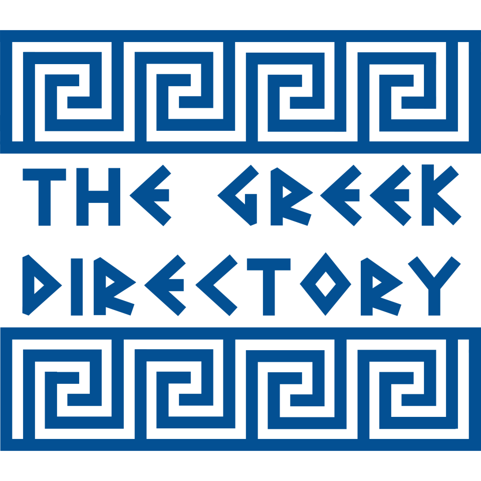

<h1><strong>Welcome to The Greek Directory!</strong></h1>

The Greek Directory™ is a growing digital hub for Greek and Greek-American life. Our mission is to connect people to all local Greek-owned businesses, parishes, schools, events, media, and resources — all in one place, unifying the Greek communities across the US and supporting the places that keep us connected. We aspire to grow beyond the US to other countries, to better support our Greek diaspora around the world.

---------------------

Copyright © The Greek Directory, 2025-present. All rights reserved.
For more information, visit https://thegreekdirectory.org/legal.
