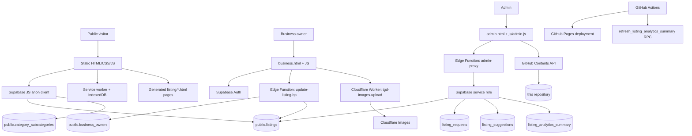
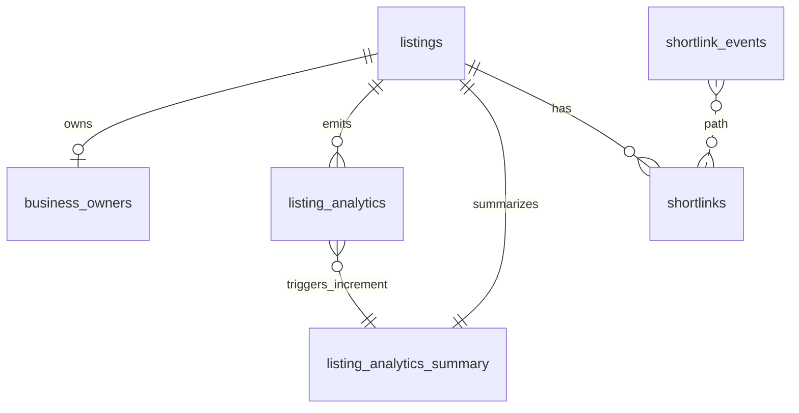

# The Greek Directory Listings

Developer documentation for **The Greek Directory**, a static-first web application for discovering, managing, and promoting Greek-owned and Greek-themed businesses. The repository contains the public website, listing search experience, generated listing pages, business owner portal, admin portal, PWA assets, Cloudflare Worker code, Supabase Edge Function source mirrors, and deployment workflows.

> **Supabase source of truth:** `SUPABASE.md` is the authoritative reference for the database schema, tables, views, RPC/database functions, RLS policies, storage configuration, Edge Functions, authentication setup, and analytics architecture. This README summarizes how the application uses Supabase; consult `SUPABASE.md` before making backend or policy changes.

## Project overview

The application serves a searchable directory of businesses and organizations with public listing pages, maps, category/location filters, owner-managed profile data, admin-managed publishing workflows, and analytics reporting.

The current implementation is a browser-heavy static site:

- Public pages are HTML/CSS/JavaScript files served directly from the repository.
- Public listing data is read from Supabase in the browser with the anon key and RLS.
- Individual listing pages under `listing/` are generated static HTML pages from `listing-template.html`.
- Admin and business owner workflows call Supabase Edge Functions and the Supabase JavaScript client.
- PWA support adds offline shell caching, starred listings, settings, and mobile-app-style navigation.

## Features

### Public directory

- Home page with search autocomplete, featured listings, recent listings, category navigation, SEO metadata, and PWA registration.
- Listings page with full client-side search/filtering, category and subcategory filters, location filters, radius filtering, open/closed status filters, pricing and coming-soon filters, grid/list layouts, map and split-map views, URL-synced filters, and starred-only views.
- Leaflet-based map UI with marker clustering and directions links.
- Static generated listing pages with structured data, owner/contact details, photos, reviews, CTAs, hours, shortlinks, and analytics hooks.
- Submission and suggestion forms backed by Supabase intake tables.
- Reserved redirects for URL areas that exist in routing but are not active features in this repo, including events, news, posts, resources, places, and claim pages.

### Business owner portal

- Supabase Auth sign-up/sign-in/recovery for business owners.
- Listing claim flow using `business_owners.confirmation_key` or claimable unowned rows.
- Owner dashboard for editing allowed listing fields, owner visibility settings, hours, media, links, reviews, and CTAs.
- Owner analytics views using listing analytics summaries and recent event data.
- Cloudflare Images upload support through a Worker-generated direct upload URL.

### Admin portal

- GitHub-PAT-authenticated admin UI.
- CRUD for listings, business owners, listing requests, suggestions, subcategories, analytics, and shortlinks via the `admin-proxy` Supabase Edge Function.
- Static listing page generation from `listing-template.html` and GitHub Contents API writes.
- CSV import helpers, sitemap updates, Cloudflare Images upload support, custom/system shortlink management, and listing analytics inspection.

### PWA/offline support

- Web app manifest for the public app and a separate business portal manifest.
- Service worker with static/runtime caches and offline fallback page.
- IndexedDB-backed starred listings for installed/PWA mode.
- PWA dock, settings, directions helpers, and offline translation support.

## Architecture



## Technology stack

| Area | Implementation |
| --- | --- |
| Frontend | Static HTML, vanilla JavaScript, CSS, Tailwind CSS output |
| CSS tooling | Tailwind CSS v4 CLI plus a local utility CSS build script |
| Data/API | Supabase Postgres, Supabase Auth, Supabase Edge Functions, Supabase JS v2 CDN |
| Maps/geocoding | Leaflet, Leaflet.markercluster, browser geolocation, Nominatim fallback geocoding |
| Media | Cloudflare Images through `cloudflare/tgd-images-upload.js` |
| PWA | Web App Manifest, service workers, Cache API, IndexedDB |
| Admin publishing | GitHub Contents API writes to generated static pages and sitemaps |
| Deployment | GitHub Pages workflow; production/branch domains configured by repository files |
| Translation widget | GTranslate script on public pages |

## Repository structure

```text
.
├── *.html                         # Public pages, admin portal, business portal, PWA pages
├── css/                           # Page-specific CSS files
├── js/                            # Public, admin, business, forms, and shared browser scripts
│   └── pwa/                       # PWA app shell, dock, settings, storage, starred listings
├── listing/                       # Generated static listing pages
├── listing-template.html          # Template used by admin generation workflow
├── images/                        # Local listing/category/logo assets still stored in repo
├── assets/images/logo/            # Logo/favicon source assets
├── partials/                      # Header/footer partials loaded client-side
├── widgets/                       # Embeddable widgets
├── cloudflare/                    # Cloudflare Worker source for image uploads
├── functions/                     # Cloudflare Pages middleware for gated branch access
├── supabase/edge-functions/       # Source mirrors/reference copies for deployed Edge Functions
├── supabase/sql/                  # SQL/reference exports
├── .github/workflows/             # GitHub Pages deploy and analytics refresh workflows
├── src/input.css                  # Tailwind input
├── src/output.css                 # Generated CSS output committed for static hosting
├── scripts/build-tailwind-output.js
├── generate-sitemap.js            # Node sitemap generator using listings-database.json
├── listings-database.json         # Static listing data snapshot used by sitemap tooling
├── SUPABASE.md                    # Authoritative Supabase audit/reference
└── README.md                      # This file
```

## Supabase integration overview

The frontend uses a hard-coded Supabase project URL and anon key in browser scripts. Public reads depend on Supabase RLS policies, not on hiding the anon key. Administrative and owner write paths use server-side Edge Functions where service-role access is needed after custom authorization checks.

Primary integration points:

- `js/index.js` loads visible listings for home page cards and search predictions.
- `js/listings.js` loads all visible listings for the directory, map, filters, sorting, and starred listing synchronization.
- `js/supabase-config.js`, `js/business-auth.js`, and `js/business-dashboard.js` implement business owner auth, claim, dashboard, and update flows.
- `js/submit.js` inserts new listing requests into `listing_requests`.
- `js/suggest-edit.js` inserts edits into `listing_suggestions`.
- `js/admin.js` calls the `admin-proxy` Edge Function for service-role-backed admin operations.

### Edge Functions

The deployed Edge Functions are mirrored in `supabase/edge-functions/` for review and editing:

| Function | Purpose |
| --- | --- |
| `admin-proxy` | GitHub-token-authenticated admin API that performs CRUD on listings, owners, requests, suggestions, analytics, subcategories, and shortlinks using the service role key. |
| `update-listing-bp` | Authenticated business portal write endpoint. Verifies the caller's Supabase JWT and `business_owners.owner_email`, then applies an allowlist of owner-editable fields. |
| `listing-server-time` | Returns authoritative UTC time for open/closed calculations and disables caching. |
| `update-github-file` | Uses a server-side `GITHUB_TOKEN` to update repository files through the GitHub Contents API. |

See `SUPABASE.md` for exact deployed function metadata, environment variables, RLS context, and implementation details.

## Data model overview

High-level tables used by the application:

| Table | Role in the app |
| --- | --- |
| `listings` | Core business/organization profile data: identity, category, tier, location, contact info, media, hours, social links, reviews, SEO, visibility, claim status, and closure flags. |
| `business_owners` | Owner/contact metadata, claim keys, owner auth matching fields, visibility preferences, and claim lockout state. |
| `listing_analytics` | Raw per-listing analytics events such as views, calls, website clicks, directions, shares, and video actions. |
| `listing_analytics_summary` | Pre-aggregated counters by listing/action/time window for dashboards and admin reporting. |
| `listing_requests` | Public intake queue for new listing submissions. |
| `listing_suggestions` | Public/community edit suggestions awaiting admin review. |
| `shortlinks` | Shortlink definitions for listing redirects, including system-generated and owner-customized links. |
| `shortlink_events` | Shortlink click log with path-based event tracking. |
| `category_subcategories` | Category/subcategory lookup data and schema.org type mapping. |



`SUPABASE.md` includes the complete schema, constraints, indexes, triggers, functions, RLS policies, and known legacy database objects.

## Authentication and authorization

### Public users

Public visitors are anonymous. They can read visible listing data and submit listing requests/suggestions according to Supabase RLS.

### Business owners

Business owners authenticate with Supabase Auth. Sign-up and claim flows validate a listing against `business_owners`, create or update an owner record, and store owner metadata for subsequent dashboard access. Password recovery and email redirects use the production URL because Supabase redirect origins are whitelisted.

Owner writes should go through `update-listing-bp`. That function validates the JWT, matches the caller's email against `business_owners.owner_email`, synchronizes missing owner email values, and only writes fields explicitly allowed for owners.

### Admins

The admin portal does not use Supabase Auth. It accepts a GitHub personal access token, stores it in browser local storage, and sends it to `admin-proxy` as `x-github-token`. The Edge Function validates the token against the GitHub repository API and then uses the Supabase service role key for database operations.

## Analytics overview

Analytics are centered on the current `listing_analytics` and `listing_analytics_summary` tables:

1. Client code inserts or admin/owner workflows read raw listing events from `listing_analytics`.
2. A database trigger runs after inserts and increments `listing_analytics_summary` counters.
3. Dashboards and admin tools read pre-aggregated summary rows for fast reporting.
4. A scheduled GitHub Actions workflow calls `refresh_listing_analytics_summary` daily to recompute summary windows.

`SUPABASE.md` documents a design caveat: incremental time-window counters need periodic refresh because they increment on insert and do not automatically decrement as events age out of a window. It also identifies legacy analytics SQL functions that reference old/nonexistent tables; do not build new functionality on those legacy functions.

## Search functionality

Search is implemented in two layers:

- **Home page search:** `js/index.js` loads a limited set of visible listings from Supabase and provides autocomplete-style predictions across business name, tagline, category, city, and state before navigating to `/listings?q=...`.
- **Listings page search/filtering:** `js/listings.js` loads visible listings once, then applies client-side filtering and sorting across normalized business names, taglines, descriptions, addresses, category/subcategory selection, location fields, radius, hours status, online-only status, pricing, coming-soon status, and starred status.

The database also contains a `search_listings` RPC documented in `SUPABASE.md`, but current browser search primarily uses client-side filtering after loading visible listing rows.

## Listing and event architecture

Listings have two representations:

1. **Database rows** in Supabase (`listings` plus related owner, analytics, and shortlink records).
2. **Generated static pages** in `listing/`, built from `listing-template.html` by the admin portal.

The admin generation flow reads listing data, resolves an appropriate shortlink, applies template replacements, writes `listing/<slug>.html` to GitHub, and updates sitemap data where requested. Public directory and home pages use live Supabase data, while individual listing URLs are static generated pages committed to the repository.

The repository currently reserves `/event` and `/events` routes through `_redirects`, but there is no active event data model or event UI in the current implementation. Treat events as reserved URL space rather than an implemented product area unless the codebase adds corresponding data and pages.

## Deployment architecture

### GitHub Pages

`.github/workflows/static.yml` deploys the entire repository as static content to GitHub Pages on pushes to `main` and manual workflow runs. The workflow uploads `.` as the Pages artifact, so generated assets and static listing pages must be committed to be deployed.

`CNAME` configures the current Pages custom domain for this branch/deployment.

### Supabase

Supabase is the hosted backend for data, auth, Edge Functions, and analytics. Backend details are maintained in `SUPABASE.md`; deployed Edge Function source mirrors are under `supabase/edge-functions/`.

### Cloudflare

The repository includes two Cloudflare-oriented pieces:

- `cloudflare/tgd-images-upload.js`: Worker for Cloudflare Images upload flows used by admin and business portal media uploads.
- `functions/_middleware.js`: Cloudflare Pages middleware that gates a branch/preview deployment behind `?access=granted` and rewrites same-origin asset/navigation URLs to preserve the access parameter.

### Scheduled analytics refresh

`.github/workflows/refresh-analytics-summary.yml` runs daily at midnight UTC and can also be run manually. It calls the Supabase REST RPC endpoint for `refresh_listing_analytics_summary` using repository secrets.

## Development workflow

### Prerequisites

- Node.js and npm for Tailwind/build tooling.
- A static file server for local browser testing.
- Network access to Supabase/CDNs for live data, maps, Supabase JS, GTranslate, and third-party assets.
- Optional admin/business testing credentials if validating authenticated workflows.

### Install dependencies

```bash
npm install
```

### Build CSS

```bash
npm run tailwind:build
```

This runs `scripts/build-tailwind-output.js`, which invokes the Tailwind CLI and appends project-specific utility CSS needed by the static pages.

For local iterative CSS work:

```bash
npm run tailwind:watch
```

### Run locally

Because the app is static, use any local static server from the repository root:

```bash
python3 -m http.server 8000
```

Then open `http://localhost:8000/`.

Notes for local development:

- Browser pages still call the production Supabase project and external CDNs.
- Some auth redirects intentionally use `https://thegreekdirectory.org`.
- Service workers can cache aggressively; use a private window, unregister service workers, or hard refresh when debugging static assets.
- GitHub Pages redirects in `_redirects` may not be honored by a simple local file server.

### Generate sitemap snapshot

```bash
node generate-sitemap.js
```

This script reads `listings-database.json` and writes `sitemap.xml`. The admin portal also contains sitemap update logic that writes through GitHub API flows.

## Environment variables and secrets

The static browser app does not read local `.env` files. Configuration discoverable in the repository is either hard-coded for public browser use or expected as hosted platform secrets.

| Location | Variable/secret | Purpose |
| --- | --- | --- |
| Supabase Edge Functions | `SUPABASE_URL` | Supabase project URL for server-side clients. |
| Supabase Edge Functions | `SUPABASE_ANON_KEY` | Used by `update-listing-bp` to validate caller JWT via an anon client. |
| Supabase Edge Functions | `SUPABASE_SERVICE_ROLE_KEY` | Service-role database access for `admin-proxy` and `update-listing-bp`. |
| Supabase Edge Functions | `GITHUB_TOKEN` | Used by `update-github-file` to update repository files. |
| GitHub Actions secrets | `SUPABASE_URL` | REST endpoint base URL for scheduled analytics refresh. |
| GitHub Actions secrets | `SUPABASE_SERVICE_ROLE_KEY` | Authorization for scheduled analytics refresh RPC. |
| Cloudflare Worker | `CLOUDFLARE_ACCOUNT_ID` | Cloudflare Images account identifier. |
| Cloudflare Worker | `CLOUDFLARE_IMAGES_API_TOKEN` | Cloudflare Images API token. |
| Admin browser session | GitHub PAT | Entered in the admin UI and sent as `x-github-token` to `admin-proxy`. |

The Supabase anon key is intentionally present in browser JavaScript. Do not put service-role keys, GitHub tokens, or Cloudflare API tokens in browser code.

## Important implementation notes

- `SUPABASE.md` overrides this README for every Supabase detail.
- The repository contains committed generated assets (`src/output.css`, `listing/*.html`, sitemaps). Changes to generation logic may require regenerating and committing outputs.
- Public listing rows are live Supabase reads; individual listing pages are static generated files and can drift until regenerated.
- Admin writes bypass RLS through `admin-proxy` after GitHub token validation. Review the Edge Function before changing admin authorization behavior.
- Business owner writes should stay constrained to the `update-listing-bp` allowlist.
- `listing-server-time` exists so open/closed status is not dependent on a visitor's local device clock.
- Supabase standard storage buckets are not used for listing media in the audited configuration; media upload flows use Cloudflare Images.
- `cloudflare/tgd-images-upload.js` is Worker source and is not part of the GitHub Pages static site runtime unless deployed to Cloudflare.
- Reserved routes in `_redirects` are not evidence of implemented event/news/blog/resource systems.

## Additional documentation

- `SUPABASE.md` — authoritative Supabase audit and implementation reference.
- `supabase/edge-functions/README.md` — notes about Edge Function source mirrors.
- `TAILWIND_PRODUCTION_SETUP.md` — Tailwind production setup notes.
- `CATEGORY_IMAGES.md` — category imagery notes.
- `aboutus.md` — source content for About page copy/history.
